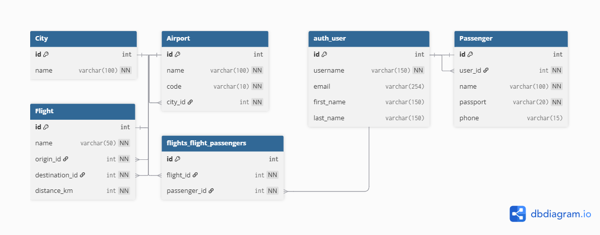

# سامانه رزرو پرواز (Flight Booking System)

یک وب‌اپلیکیشن کامل با **Django** برای مدیریت پروازها، ثبت‌نام مسافران و نمایش پروازهای شخصی کاربران.

## ویژگی‌های اصلی پروژه

- ثبت‌نام و ورود کاربران (با فرم Django)
- لیست کامل پروازها با جزئیات فرودگاه، شهر و فاصله
- ثبت‌نام مسافر در پرواز دلخواه (فقط کاربران لاگین‌شده)
- صفحه شخصی "پروازهای من" برای هر کاربر
- پنل مدیریت پروازها فقط برای ادمین‌ها یا کاربران دارای مجوز
- استفاده از **PostgreSQL** به عنوان دیتابیس
- طراحی responsive با **Bootstrap 5** و آیکون‌های Font Awesome
- ساختار MVT جنگو + روابط ManyToMany و OneToOne

## تکنولوژی‌های استفاده‌شده

- **Backend**: Django 5.x
- **Database**: PostgreSQL 18
- **Frontend**: Bootstrap 5 (RTL) + Font Awesome
- **Authentication**: Django Authentication System
- **ORM**: Django ORM
- **Python**: 3.10+

## پیش‌نیازها

- Python 3.10 یا بالاتر
- PostgreSQL 15+ (یا هر نسخه جدید)
- Git

## راه‌اندازی پروژه (Local)

1. پروژه را کلون کنید:
   ```bash
   git clone https://github.com/fmiri105/Airport_project.git
   cd Airport_project

   ### نمودار ERD پایگاه داده

این نمودار ساختار موجودیت‌ها و روابط پروژه را نشان می‌دهد:



**توضیح مختصر:**
- **City** → شهرها
- **Airport** → فرودگاه‌ها (مرتبط با شهر)
- **Passenger** → مسافران (مرتبط با کاربر جنگو)
- **Flight** → پروازها (مبدا و مقصد فرودگاه)
- **flights_flight_passengers** → جدول واسط ثبت‌نام مسافران در پروازها (Many-to-Many)